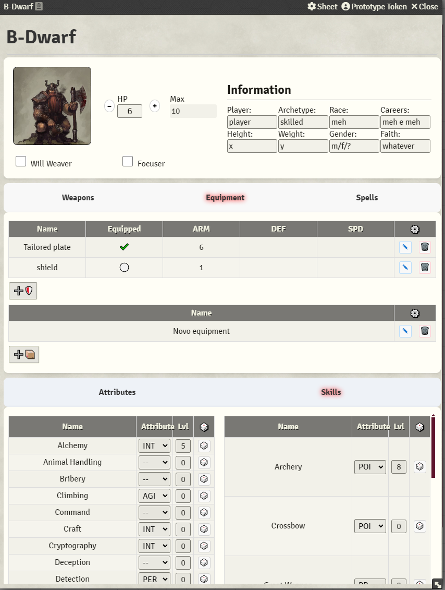
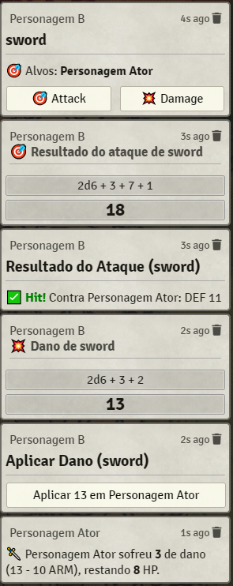
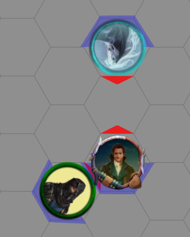

# IKRPG for Foundry VTT

### ***This is a WORK IN PROGRESS***

**IKRPG** (Iron Kingdoms Roleplaying Game) is a custom system for Foundry Virtual Tabletop, built to support the
mechanics and flavor of the Iron Kingdoms universe.  
This project was designed from the ground up to faithfully implement character sheets, dice rolls, inventory, and
derived stats according to the IKRPG rules.

---

## 🎯 Purpose

This system aims to provide a structured and automated character sheet for use in campaigns set in the Iron Kingdoms
setting, with a focus on:

- Clean, functional, and modular character sheets
- Automatic dice rolls using 2d6 + modifiers
- Attribute-driven derived values (like HP, DEF, ARM)
- Fully customizable skill system with fixed skill names and editable attributes/levels
- Categorized inventory management with dynamic weapon rolls
- Support for actor types: Character, NPC, Steamjack

---

## 🧰 Features

### Character sheets

- **Main and Secondary Attributes**: STR, AGL, PHY, INT, PER, ARC, PRW, POI, SPD
- **Derived Attributes**: INIT, WILL, DEF, ARM, HP (auto-calculated for characters)
- **Rollable Attributes**: Click on any attribute name to roll 2d6 + that attribute
- **Occupational & Military Skills**:
    - Predefined skill names
    - Automatic skill rolls: 2d6 + attribute + level
    - Social skills allow neutral attribute association (using `--`)
- **Dynamic Inventory System**:
    - Separate item types: melee weapons, ranged weapons, armor, and equipment
    - Dedicated inventory tabs for weapons and general equipment
    - Weapon entries allow customizable tags (e.g., "fire", "magical", "cutting")
    - Roll attacks directly from weapon entries using associated skill rolls
- **Armor Integration**:
    - Equipped armor modifies DEF, ARM, and MOVE
    - Auto-calculated penalties and bonuses
- **HP Management**:
    - Integrated buttons to easily increase or decrease HP
  

  
  
  

### Combat

- **Automation**:
    - Initiative integrated into Foundry VTT's combat tracker
    - Combat rolls sent to chat with hit/miss and damage resolution
  

  
  
  

- **Steamjack Support**:
  - Dedicated actor type and sheet
  - Includes fields like chassis, fuel, cortex (text for now)
  - Steamjacks do not recalculate derived stats automatically, some jacks have stats not relying on atributes
  - Chassis selector (Light/Heavy) changes token size in real-time
- **Token Direction Indicators**:
  - Tokens display red (front) and blue (rear) directional arrows
  - Works with square and hex grids
  - Updates on rotation with automatic angle snapping

---

## 🛠 Planned Features

- Ability and Spell management (planned architecture ready)
- Status and condition tracking (tentative, depending on complexity)
- Localization (pt-BR and en-US initially, system prepared for further languages)
- No official compendium creation (due to legal and maintenance concerns)

---

## 📜 Licensing

This system is a **fan-made adaptation** of the Iron Kingdoms RPG for use with Foundry VTT.  
All intellectual property related to Iron Kingdoms is owned by its respective owners.  
This project is not affiliated with or endorsed by _Privateer Press_ or _Steamforged Games_ and claims no ownership over
their material.

---

## 💡 Contributions & Feedback

This project is a work in progress. If you'd like to contribute code, help test, or provide feedback, feel free to fork
or contact the author.

---